<h3 id="october-29-2019-week-9">October 29, 2019 (Week 9)</h3>

 Breadboarded Milestone: This week I successfully breadboarded and demostrated my sensor in front of my Professor(Kristian). 

 Sensor Breadboarded: 

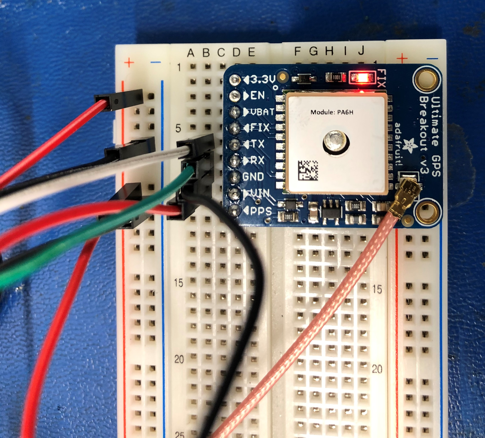
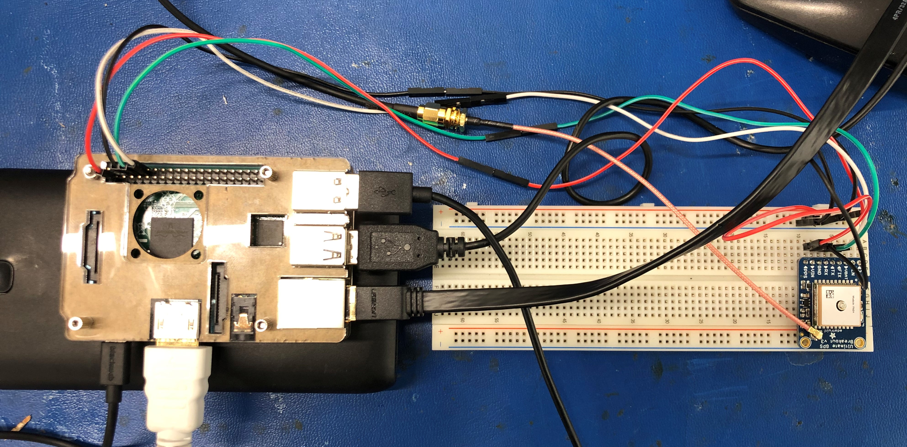

 In order for my sensor to work I had to Disable Serial console and Enable UART on my Pi. By running "sudo raspi-config" in the terminal window. Next I went to <b>Interfacing Options -> Serial -> Select "No" on enabling the login shell -> Select "Yes" on enabling serial port hardware</b>

 This is what I got: 

 Next I ran a few commands to get the the sensor to display its respective results: 

<b> sudo killall gpsd </b>

<b> sudo gpsd /dev/serial0 -F /var/run/gpsd.sock </b>

<b> cgps -s </b>

 These are the results I got: 

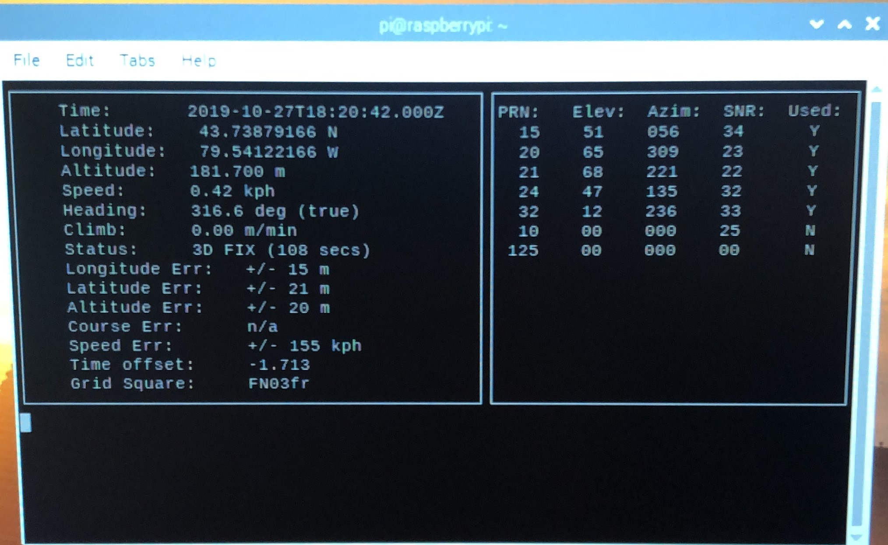

<h3 id="october-15-2019-week-7">October 15, 2019 (Week 7)</h3>

 PCB Designed 

 Designed my PCB, Schematic, and Breadboard Design. I also sent my gerber files to the Prototype Lab. You can view my fritzing file <a href="https://github.com/rickyramnath97/gps/blob/master/electronics/GPS%20Fritzing2.fzz">here</a>. 

 I am also getting my Broadcom Development Platform set up with VNC Viewer to work with the Humber College WiFi network. 
 

PCB Designed: 

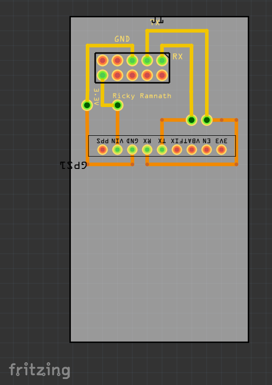

Schematic: 

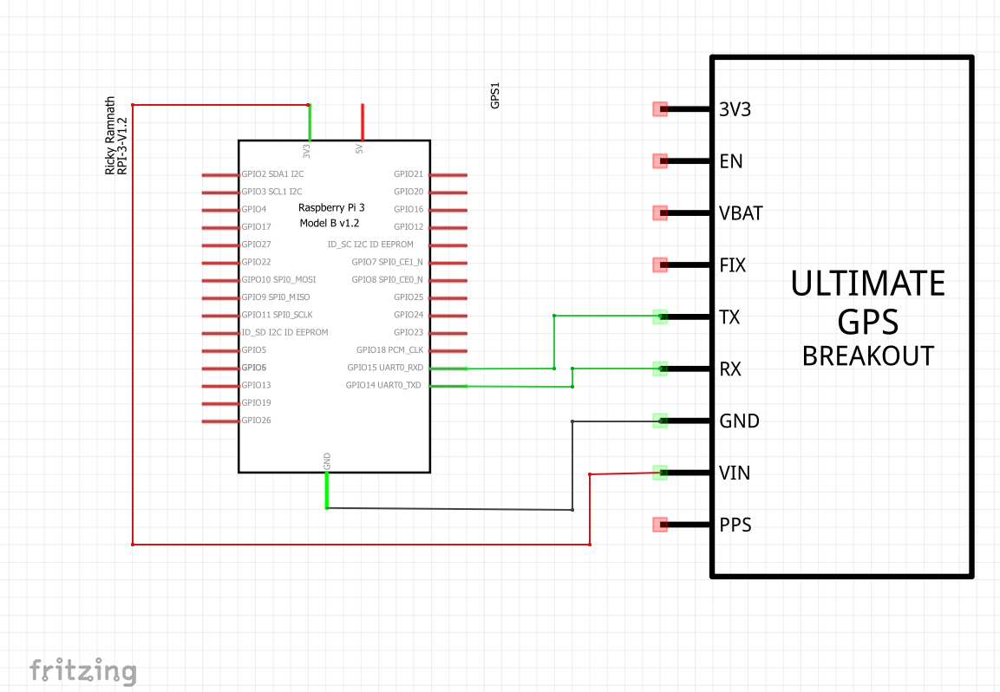

Breadboard Design: 

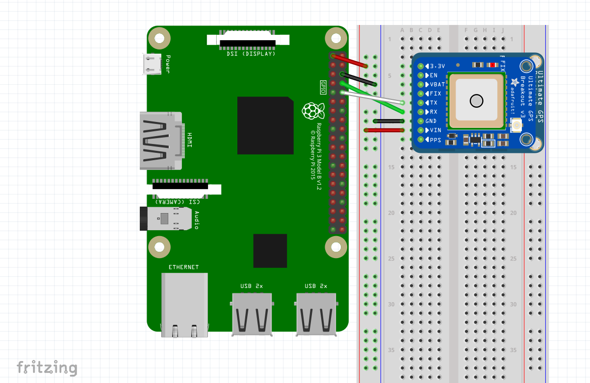

<h3 id="october-8-2019-week-6">October 8, 2019 (Week 6)</h3>

 Showing my acquisitions 

 Package arrived Thursday, October 3rd, 2019: 

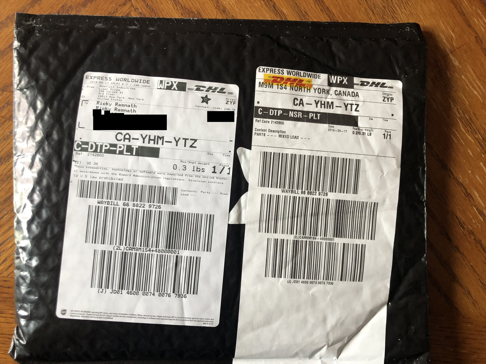

 Contents of package include; GPS Sensor, Adapter cable for antenna, and antenna: 

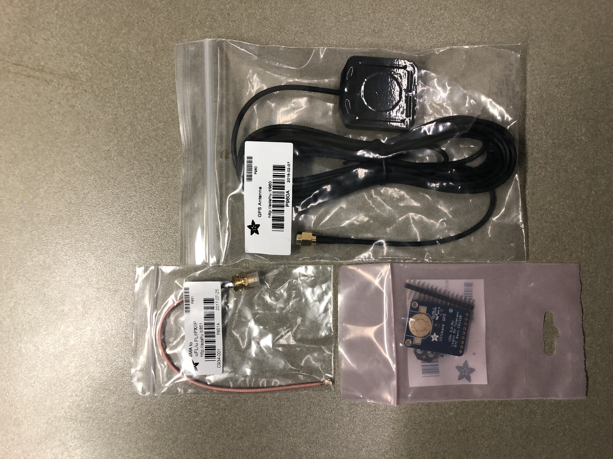

 I had also watched a <a href="https://youtu.be/3230nCz3XQA">video</a> on how to solder my header pins and was able to do so. I used my own Lead Free solder with Rosin Core and a soldering iron that I had borrowed from work. This was the outcome:

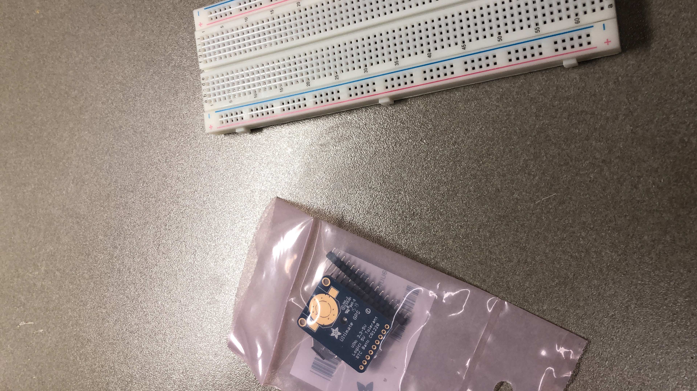

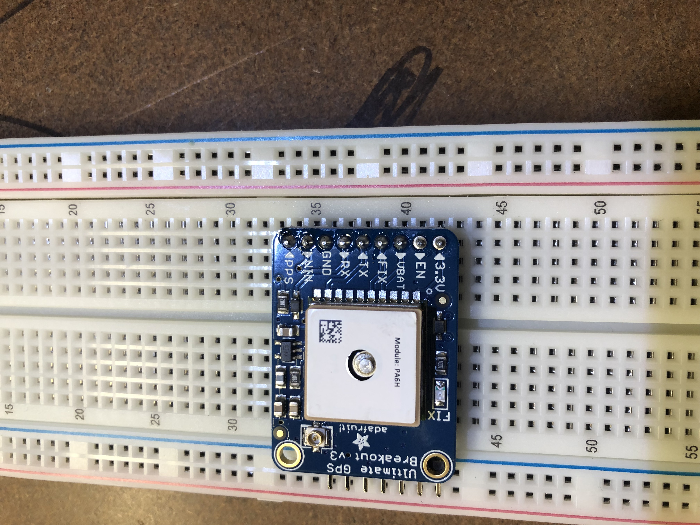

<h3 id="october-1-2019-week-5">October 1, 2019 (Week 5)</h3>

 Setting up my broadcom development platform (RPI) 

 Parts Ordered 

 Proof of Purchase: 

<h3 id="september-24-2019-week-4">September 24, 2019 (Week 4)</h3>
  

<a href="https://github.com/rickyramnath97/gps/blob/master/documentation/Rickys%20Budget.xlsx">Budget Completed!</a>.

  
- Ordered Parts

<h3 id="september-17-2019-week-3">September 17, 2019 (Week 3)</h3>
   

<a href="https://github.com/rickyramnath97/gps/blob/master/documentation/CENG317%20Project%20Plan.gan">Gantt Chart Completed!</a>

 
- Met with collaborators 
 
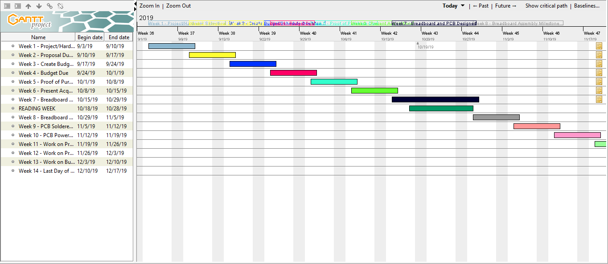

 
  
<h3 id="september-09-2019-week-2">September 9, 2019 (Week 2)</h3>

 Handed in <a href="https://github.com/rickyramnath97/gps/blob/master/documentation/ProposalContentStudentNameRev03.xlsx">proposal</a>. 

 For my hardware, I chose the Adafruit Ultimate GPS Breakout. This will be able to display location. My goal is to make the project scalable from one location to several for our Capstone Project. To enhance the user experience, having a GPS Sensor is crucial to detect which parts crib data belong to which. Additionally, the GPS will prioritize orders by accessing location from students and finding out how long it will take for student to arrive to the parts crib. From that we will know which orders to get ready first in priority sequence based on travel time. 

  
  

 Image of Sensor: 

  

 Working on Gantt Chart 

<h3 id="september-03-2019-week-1">September 3, 2019 (Week 1)</h3>

Welcome! 

Repo Created! 

Created <a href="https://github.com/rickyramnath97/gps/blob/master/documentation/ProposalContentStudentNameRev03.xlsx">proposal</a>.

